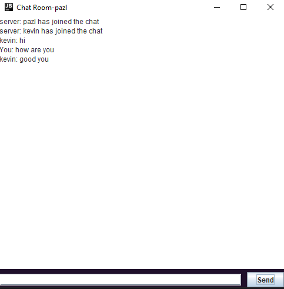

# Chat room
- [Description](#description)
- [How to run](#how-to-run)
- [Plans](#plans)

## Description
This is a simple chat room application that allows users to chat with each other in real time. 
The application is build using Java Socket and Java Swing.

## How to run
- Clone the repository
- Open the project in your favorite IDE
- Run the server first!
- Run the client
- Enter a username in the console
- Create as many clients as you want
- Start chatting!

## Plans
- [ ] Changing color for each username
- [ ] nicer UI

